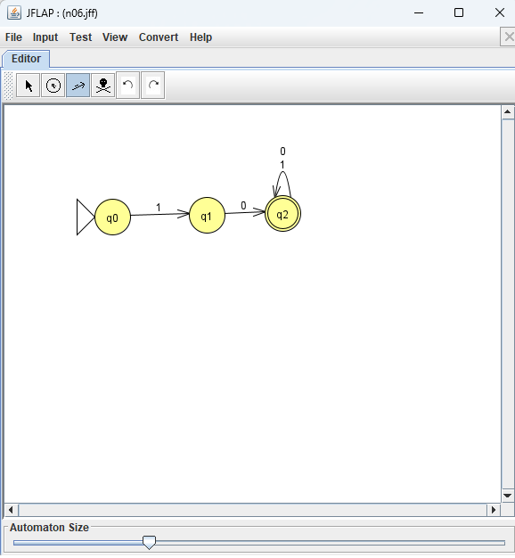
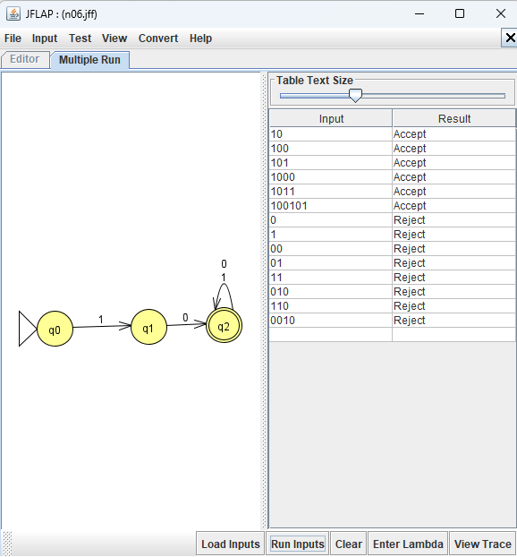
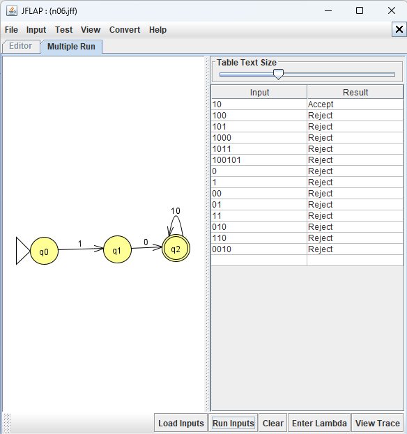

# Problem 6: Strings that start with 10
 {string s| s starts with 10 } 

## NFA

## Test results

## Mistake and fix
My first version rejected `100`, even though it starts with `10`.

I had put `1,0` on one loop at the accepting state. JFLAP treated that as one transition label, so it did not read the final `0` in `100` as I expected. 
I fixed it by making two separate loops at the accepting state: one labeled `0` and one labeled `1`. I then saved the corrected `n06.jff` and ran the test strings again.
