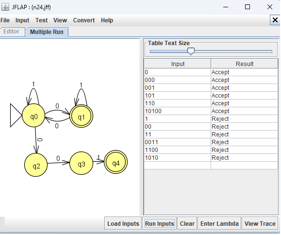
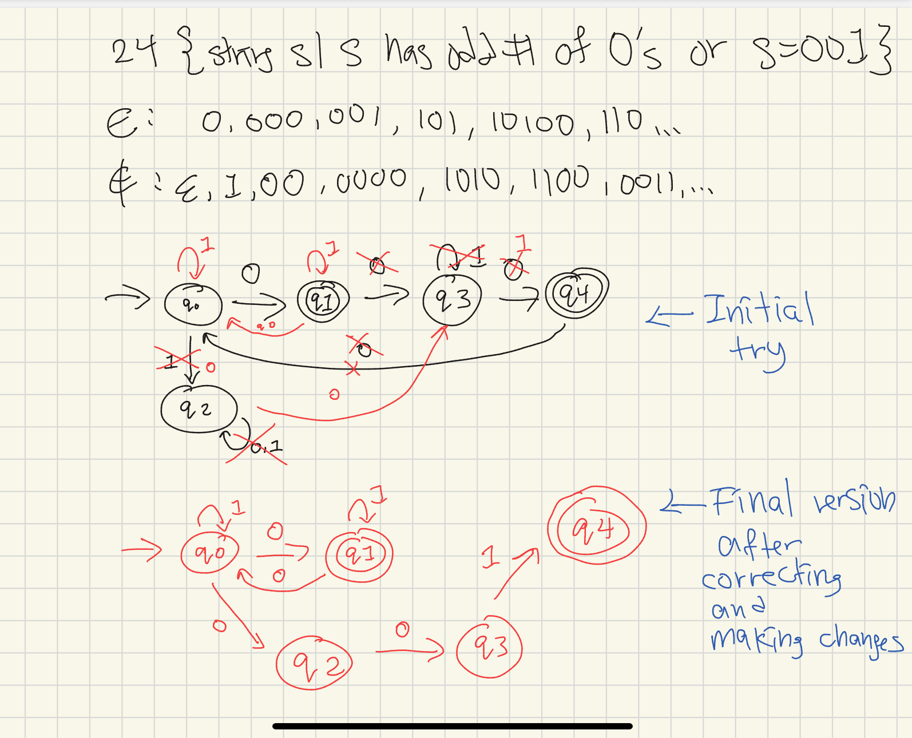
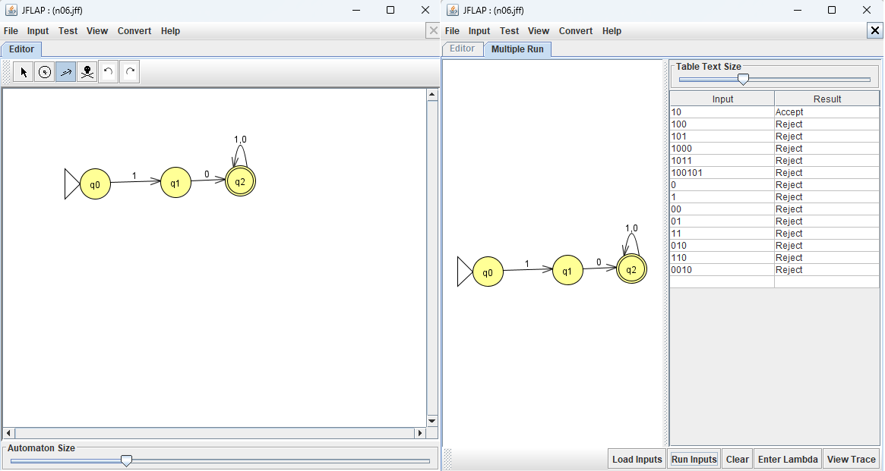

# Problem 24
{string s| s has odd # of 0's or s=001} 

## NFA

## Hand-drawn computation tree for 001

## Multiple Run results

After reading 001, one path ends at q0 and another ends at accepting state q4.
Therefore, the NFA accepts 001.

All tested strings gave the expected results.
